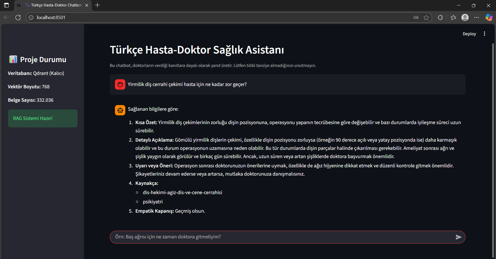
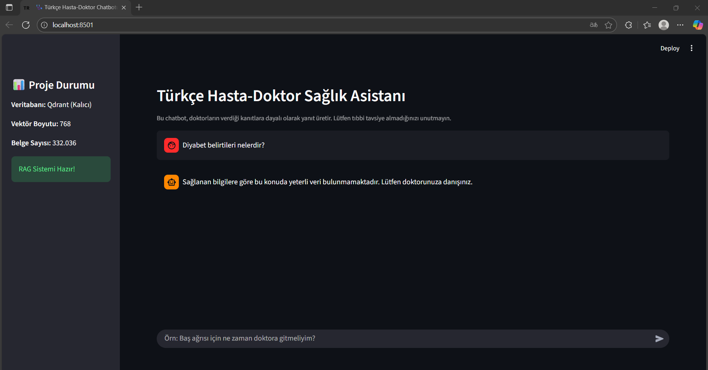

# 🩺 SAĞLIK ASİSTANI (RAG Tabanlı Türkçe Hasta-Doktor Chatbotu)

Akbank Generative AI Projesi kapsamında geliştirilen, **Retrieval-Augmented Generation (RAG)** mimarisi ile güçlendirilmiş **Türkçe Hasta-Doktor Sağlık Asistanı** projesidir. Amacı, Büyük Dil Modellerinin (LLM) halüsinasyon riskini sıfırlayarak, kullanıcılardan gelen sağlık sorularına doktorların verdiği kanıtlara dayalı, güvenilir ve akıcı Türkçe yanıtlar üretmektir.

## 🎯  Proje Hakkında

Bu proje, Türkçe Hasta-Doktor Soru-Cevap verisine dayalı bir AI asistanı oluşturur. Hugging Face'teki veri setini kullanarak, kullanıcılardan gelen sağlık sorularını doktorların verdiği kanıtlara dayandırarak güvenilir ve akıcı Türkçe ile yanıtlamaktır.

**Teorik Problem Çözümü**: Büyük Dil Modellerinin (LLM) **halüsinasyon** üretme riskini **RAG (Retrieval-Augmented Generation)** mimarisi ile sıfırlayarak, elde edilen cevapların veri setindeki doktor metinlerine dayandırılmasını garanti etmektir.

## 📋 Veri Seti Hazırlama

### Veri Seti Bilgileri

- **Veri Seti**: https://huggingface.co/datasets/kayrab/patient-doctor-qa-tr-167732 (Hugging Face)

- **İçerik**: Türkçe hasta soruları ve ilgili doktor cevaplarından oluşur.

- **Toplanış Metodolojisi**: Veri seti, çeşitli sağlık platformlarından elde edilmiş ve anonimleştirilmiş gerçek hasta-doktor iletişimlerini temsil etmektedir. Projede herhangi bir manuel veri toplama işlemi yapılmamış, hazır veri seti kullanılmıştır.

### Veri Ön İşleme 

- **Ön İşleme**: Ham veri, eksik değerlerden, gereksiz boşluklardan temizlenmiş ve tekrarlanan 171.073 kayıt silinmiştir. Bu optimizasyonlar sonucunda proje, 332.036 benzersiz soru-cevap çifti üzerinde çalışmaktadır.

- **Format**: Cevap metinleri (content) Qdrant'a, doktor uzmanlık bilgileri ise metadata olarak saklanmıştır (Gelişmiş arama ve kaynak gösterme için).

## 🧠 Kullanılan Yöntemler

### 🔹 1. **RAG (Retrieval-Augmented Generation) Mimarisi**
Modelin yanıt doğruluğunu artırmak için RAG yaklaşımı kullanıldı.  
RAG iki ana bileşenden oluşur:
- **Retriever:** Qdrant Document Store üzerinde vektör benzerliğiyle ilgili belgeleri bulur.  
- **Generator:** Bulunan belgeleri kullanarak bağlama duyarlı yanıt üretir.

### 🔹 2. **Embedding Model**
- **Model:** `sentence-transformers/paraphrase-multilingual-MiniLM-L12-v2`
- **Boyut:** 384  
- **Amaç:** Türkçe cümleleri yüksek boyutlu vektör uzayında temsil ederek anlamsal benzerlik analizi yapmak.

### 🔹 3. **Vektör Veritabanı – Qdrant**
Belgeler embedding’lere dönüştürülüp `Qdrant` veritabanına yazıldı.  
Bu sayede sorgulara benzer belgeler milisaniyeler içinde bulunabiliyor.

### 🔹 4. **LLM (Cevap Üretimi)**
- **Model:** Google Gemini API 
- **Amaç:** Belgelerden dönen bilgilerle bağlam zenginleştirilmiş doğal dilde yanıt üretmek.

## 🛠️ Kullanılan Teknolojiler

- **Haystack (2.x)**: RAG pipeline framework
- **Streamlit**: Web arayüzü
- **Sentence Transformers**: Türkçe embedding modeli 
- **Google Gemini**: Text generation modeli
- **Qdrant (Yerel Disk)**: Vektör veritabanı
- **Hugging Face Datasets**: Veri seti yönetimi

## ⚠️ Kritik Çözüm: Neden Qdrant?

Projenin ilk denemesinde kullanılan InMemoryDocumentStore, 3 saat süren indeksleme bittikten sonra diske kaydedilemedi (`TypeError`). Bu durum, uygulamanın her başladığında bu uzun işlemi tekrar etmesini gerektiriyordu.

Bu sorunu çözmek için Qdrant'a geçildi. Qdrant, tüm vektör indeksini otomatik olarak diske kalıcı (persistent) şekilde yazarak, indeksleme yükünü projeden tamamen kaldırmış ve sistemin dağıtıma hazır olmasını sağlamıştır.

**Özetle**: Qdrant, kalıcı ve hızlı vektör depolama çözümü sunarak üretim ortamına geçişi kolaylaştırmıştır.

## 🚀 Kurulum ve Çalışma Kılavuzu

### 1. Gerekli Paketleri Yükleyin

```bash
# Virtual environment oluşturun (opsiyonel ama önerilir)
python3 -m venv genai-env
source genai-env/bin/activate  # macOS/Linux
# genai-env\Scripts\activate  # Windows

# Paketleri yükleyin
pip install -r requirements.txt
```

### 2. API Anahtarlarını Ayarlayın

Proje kök dizininde `.env` dosyası oluşturun:

```
GOOGLE_API_KEY=your_google_api_key_here
```
### 3. Veri Ön İşleme ve İndeks Oluşturma (Tek Seferlik Kurulum)

Bu adımlar, indeksleme işlemini yapar ve `documents.pkl` ile `./qdrant_db` klasörünü oluşturur.

```bash
# Veri setini temizle ve Haystack Document listesini oluştur
python data-processing.py 

# Qdrant Vektör Veritabanını oluştur (Bu, uzun sürecek BİR KERELİK işlemdir)
python rag_index_builder.py
```


### 4. Uygulamayı Çalıştırın

```bash
streamlit run app.py
```

## 📁 Proje Yapısı

```
rag-chatbot-projesi/
├── app.py               # Ana uygulama dosyası
├── data-processing.py   # Veri temizleme ve documents.pkl oluşturma (Data Processing)
├── rag_index_builder.py # documents.pkl'i Qdrant'a vektörleme    
├── requirements.txt     # Python bağımlılıkları
├── .env                 # API anahtarları (git'e eklenmez)
├──  README.md           # Bu dosya
# --- GÖRSELLER ---
└── images/              # README'de kullanılacak ekran görüntüleri
    ├── chat-screen.png
    └── chat-screen-2.png
# --- OLUŞTURULAN (ÇALIŞTIRMA SONUCU) DOSYALAR ---
├── documents.pkl         # setup_vector_store.py çalışınca oluşur (332K belge listesi)
├── cleaned_patient_doctor_qa.csv # setup_vector_store.py çalışınca oluşur (Temizlenmiş CSV)
└── qdrant_db/            # index_builder.py çalışınca oluşur (Qdrant Vektör Veritabanı Klasörü)
```

## 🌐 Web Arayüzü

### Özellikler:

- Türkçe doğal dilde soru sorulabilir.

- Model yanıt verirken kullanılan kaynak belgeler (context) gösterilir.

### Kullanım Akışı:

- **Girdi**: Kullanıcı, sohbet kutusuna sağlıkla ilgili bir soru yazar.

- **Sorgulama**: Sistem, Qdrant'tan en alakalı doktor cevaplarını çeker.

- **Çıktı**: Gemini, çekilen bu kaynaklara dayalı olarak yanıtı üretir ve yanıtın sonunda, cevabı veren uzmanlık alanını (Kaynak/Kanıt olarak) listeler.

### Örnek Sorular: 

- "Meme kanseri erken teşhisinde kullanılan mamografi taramasına hangi yaştan itibaren başlanması tavsiye edilir?"
- "Demir eksikliği anemisi olan bir kişi beslenmesinde hangi gıdalara daha çok yer vermelidir?"
- "Spor sonrası kas ağrısı normal mi?"
- "Kalp çarpıntısı stresle ilgili olabilir mi?"
- "COVID-19 testim pozitif çıktı, nelere dikkat etmeliyim?"

## 🖥️ Ekran Görüntüsü:

**Sol Panel**: Uygulama arayüzünün sol kısmında, projenin durumuna dair anlık bilgiler sunan bir kontrol paneli yer almaktadır. Bu panelde veritabanı tipi, vektör boyutu, belge sayısı ve RAG sisteminin güncel durumu görüntülenmektedir.

**Tema**: Uygulama, modern ve göz yormayan bir Karanlık Mod (Dark Mode) tasarımıyla geliştirilmiştir. Bu tema, uzun süreli kullanımlarda kullanıcı deneyimini iyileştirmeyi amaçlamaktadır.

### Örnek Diyalog 1 - Cerrahi Soru: 



- Kullanıcı, chatbot’a “Yirmilik diş çekimi hasta için ne kadar zor geçer?” şeklinde bir soru yöneltmiştir.
Chatbot, sağlanan medikal verilerden yararlanarak kısa özet, detaylı açıklama, uyarı ve kaynak içeren çok katmanlı bir yanıt üretmiştir.
Bu yanıt formatı sayesinde kullanıcı, hem genel bilgiye hem de dikkat etmesi gereken noktalar hakkında yönlendirici önerilere ulaşır.

### Örnek Diyalog 2 - Veri Yetersizliği Durumu: 



- Kullanıcı, “Diyabet belirtileri nelerdir?” sorusunu sorduğunda sistem, bu konuda yeterli veri bulunmadığını tespit etmiş ve güvenli bir şekilde “Lütfen doktorunuza danışınız.” uyarısıyla yanıt vermiştir.
Bu durum, chatbot’un tıbbi etik ve güvenlik öncelikli tasarımını göstermektedir.

## ⚠️ Dağıtım ve Çalıştırma Notları (Deployment & Run Notes)

Bu projenin mevcut sürümü, aşağıdaki nedenlerden dolayı halka açık bir bulut platformuna (Streamlit Cloud, Heroku vb.) **DEPLOY EDİLMEMİŞTİR**:

### 1. Veritabanı Boyutu ve Mimarisi
Proje, `paraphrase-multilingual-MiniLM-L12-v2` embedding modeli kullanılarak oluşturulmuş yaklaşık **1.5 GB** boyutunda bir Qdrant vektör veritabanı (.qdrant_db klasörü) kullanmaktadır.

### 2. Maliyet ve Sınırlamalar
* **Yerel Veritabanı (Local Qdrant Mode):** 1.5 GB'lık dosyanın GitHub'a (Git LFS) yüklenmesi veya her deployment'ta harici bir kaynaktan indirilip Streamlit sunucusunda çıkarılması **uzun bir 'cold start' süresine** neden olmaktadır (tahmini 5-10 dakika).


* **Bulut Veritabanı (Qdrant Cloud/Pinecone):** Hızlı başlangıç için harici bir vektör veritabanı hizmeti kullanılabilir ancak bu, **maliyet** (ücretsiz katmanların limitleri aşıldığında) gerektirmektedir. Proje, demo amaçlı olduğu için maliyet yaratmaması adına yerel çalıştırma tercih edilmiştir.

### 3. Uygulamayı Çalıştırma Gereksinimi
Bu nedenle, uygulamayı çalıştırmak için **yerel olarak indekslenmiş veritabanına** ihtiyacınız vardır. Lütfen aşağıdaki adımları izleyin:

1.  Gerekli tüm bağımlılıkları yükleyin.
2.  `rag_index_builder.py` dosyasını çalıştırarak veritabanını **yerel diskinizde oluşturun** (Bu işlem, embedding oluşturma ve yazma nedeniyle ilk seferde 1-2 saat sürebilir).
3.  Ardından `streamlit run app.py` komutuyla uygulamayı başlatın.

## 📚 Sonuç ve Öğrenilenler

Bu proje sürecinde:
- RAG mimarisinin gerçek dünya senaryosuna uygulanmasını deneyimledim.
- Qdrant kullanarak kalıcı vektör veritabanı yönetimi öğrendim.
- Streamlit ile kullanıcı dostu bir AI arayüzü tasarladım.
Proje, gelecekte sağlık alanında etik ve güvenilir yapay zeka sistemlerinin temelini anlamama yardımcı oldu.

